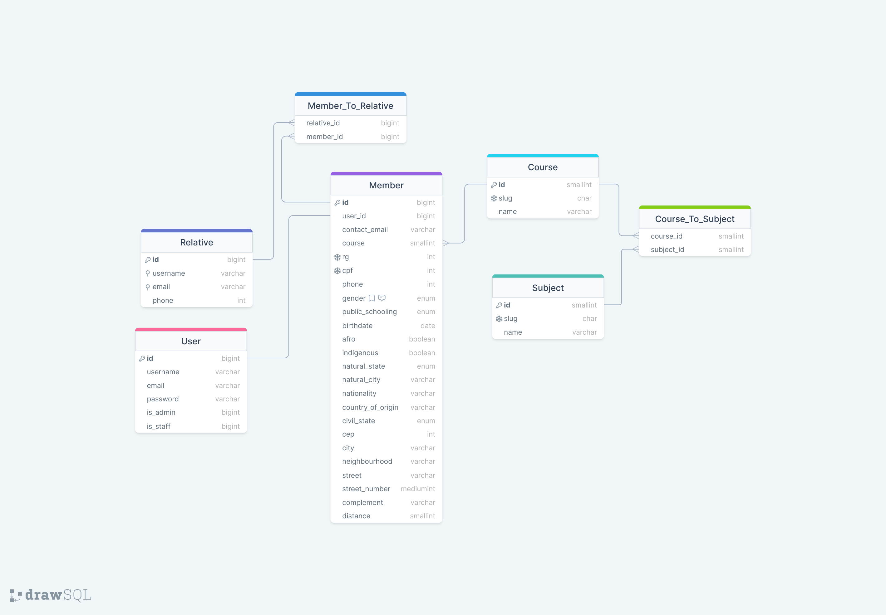
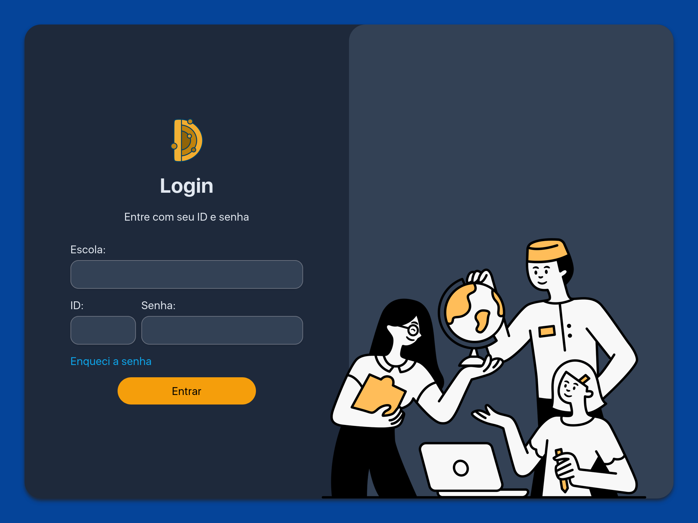

# DEMZER - um sistema acadêmico geral

## Dependências

Este projeto consiste em um servidor que pode ser gerido local ou remotamente. Para o seu funcionamento são necessárias as seguintes dependências:

- [Node JS](https://nodejs.org/pt-br) 18.16.0+ (LTS)
- [Python](https://www.python.org/downloads/) 3.11+
- MySQL (opcional)

No futuro, o app usará uma ferramenta chamada *Docker* para que funcione independente da máquina ou sistema operacional 🐳.

Primeiro, verifique que os interpretadores Python e JS foram instalados com sucesso:

```shell
python3 -v
npm -v
```

Depois instale as bibliotecas usadas pelo projeto:

```shell
pip install -r requirements.txt
npm i
```

## Migrações da base de dados

O projeto é baseado em um framework web chamado **Django**. Ele é baseado em Python e é responsável por conectar os laços entre banco de dados, lógica backend e o que o usuário final vê. Os modelos para a base de dados estão descritos na forma de classes em Python em `core/models.py`. Para aplicar esses modelos, use esses comandos em um terminal:

```shell
python3 manage.py makemigrations core # preparar códgio SQL
python3 manage.py migrate core
python3 manage.py migrate # aplicar mudanças em toda a aplicação
```

Caso os modelos sejam atualizados em qualquer ponto do desenvolvimento, faça questão de aplicar novamente as migrações. Durante o desenvolvimento, essa base de dados estará salva em `db.sqlite3`. Porém, em um ambiente de produção deve haver algumas variáveis de ambiente para que a aplicação se conecte com uma base de dados na nuvem.



## Iniciando o servidor

Para o desenvolvimento, existem dois processos rodando no computador: o servidor Django e o servidor Parcel. O Django é responsável por enviar o HTML para o navegador e receber os pedidos HTTP. O Parcel é o que se chama de um *“module bundler”* - um *empacotador de módulos.* Ou seja, ele compila as dependências do Node que você usa em um formato que o navegador reconhece 📦. Isso inclui bibliotecas usadas como TailwindCSS e AlpineJS.

Para iniciar o Parcel, digite `npm run watch` no terminal ou vá até a aba “npm scripts” na barra lateral e clique no botão de start. Você deve ver uma mensagem de sucesso após alguns segundos. Deixe esse terminal rodando - mesmo que de fundo - para que observe as mudanças no código e atualize o pacote.

Para iniciar o Django, abra um novo terminal e digite `python3 manage.py runserver`. Se tudo der certo, deverá ver uma mensagem como esta:

```shell
[niko] backend > python3 manage.py runserver
Performing system checks...

System check identified no issues (0 silenced)
May 23, 2023 - 20:40:53
Django version 4.2.1, using settings 'backed.settings'
Starting development server at http://127.0.0.1:8000/
Quit the server with CTRL-C.
```

No seu navegador, visite `http://localhost:8000` e comece a testar o app! ⚡️



## Criando um usuário admin

Para registrar alunos e funcionários, é necessário um usuário de origem. Para isso, digite no terminal `django manage.py createsuperuser`. Você entrará em um prompt no terminal; digite um nome, email e senha para concluir o processo. Depois disso, conseguirá entrar na aplicação.

Na tela de login, entre com qualquer escola, um ID igual a 1 e a senha que você digitou. Então será capaz de adicionar novos alunos na tela de matrícula, assim como professores e funcionários 🧑‍🏫

---

Uma **última dica** é que, quando você abrir o projeto no VSCode, deverá aparecer uma mensagem no canto da tela, sugerindo extensões para o editor. Essas extensões forçam um estilo de código unificado no projeto e agilizam a sua produtividade usando algumas das tecnologias instaladas.

## Tutoriais externos

- Adicionando views no Django: [https://docs.djangoproject.com/en/4.2/intro/tutorial01](https://docs.djangoproject.com/en/4.2/intro/tutorial01/#write-your-first-view)
- Usando templates no Django: [https://docs.djangoproject.com/en/4.2/ref/templates/language](https://docs.djangoproject.com/en/4.2/ref/templates/language/)
- Introdução ao TailwindCSS: [https://tailwindcss.com/docs/utility-first](https://tailwindcss.com/docs/utility-first)
- Introdução ao Alpine.js: [https://alpinejs.dev/start-here](https://alpinejs.dev/start-here)
- Usando Git e GitHub no VSCode: [https://code.visualstudio.com/docs/sourcecontrol/intro-to-git](https://code.visualstudio.com/docs/sourcecontrol/intro-to-git)

